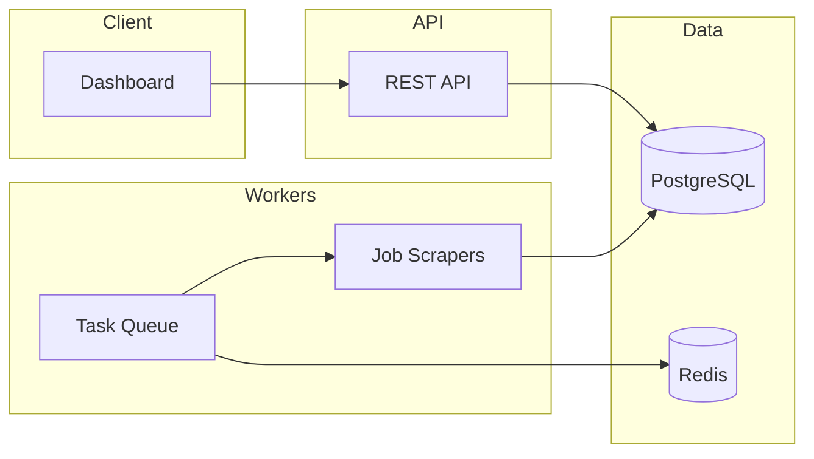

# AutoApplier — Architecture (Public Overview)

High-level system design. Implementation details remain in the private repository.

## System diagram

## Data domains

| Domain | Purpose |
|--------|---------|
| Users & Profiles | Auth, structured profile, resume text |
| Jobs | Discovered postings, dedup hash, freshness |
| Applications | User ↔ job lifecycle, match scores |
| Documents | Resume/cover letter snapshots per application |

## Scrape pipeline (Phase 1)

1. Scheduled or manual scrape task enqueued
2. Board scrapers collect normalized job records
3. Dedup via content hash; stale jobs filtered by freshness window
4. Jobs stored for listing and future matching

## Security principles

- Self-hosted; no mandatory cloud SaaS
- Secrets only in private deployment env files
- Public repo contains no credentials or scraper implementation

## Phases

| Phase | Focus |
|-------|--------|
| 1 | Foundation, scrape + store |
| 2 | Match engine, document generation |
| 3 | Auto-submit, tracker |
| 4 | Full dashboard, analytics |
